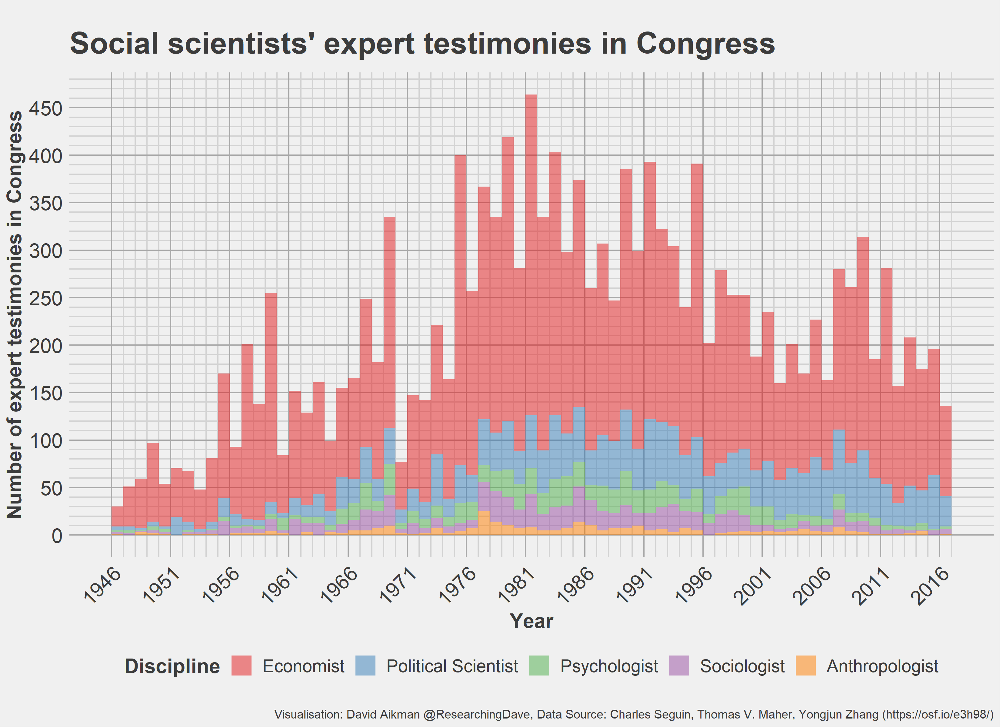

# Testimonies from social scientists in Congress

The data was originally shared by researchers Charles Seguin, Thomas V. Maher, Yongjun Zhang on the [Open Science Framework](https://osf.io/e3h98/). I found it via the [Data is Plural collection](https://docs.google.com/spreadsheets/d/1wZhPLMCHKJvwOkP4juclhjFgqIY8fQFMemwKL2c64vk/edit#gid=0).

My code in 'script.R' will produce these two visualisations:

